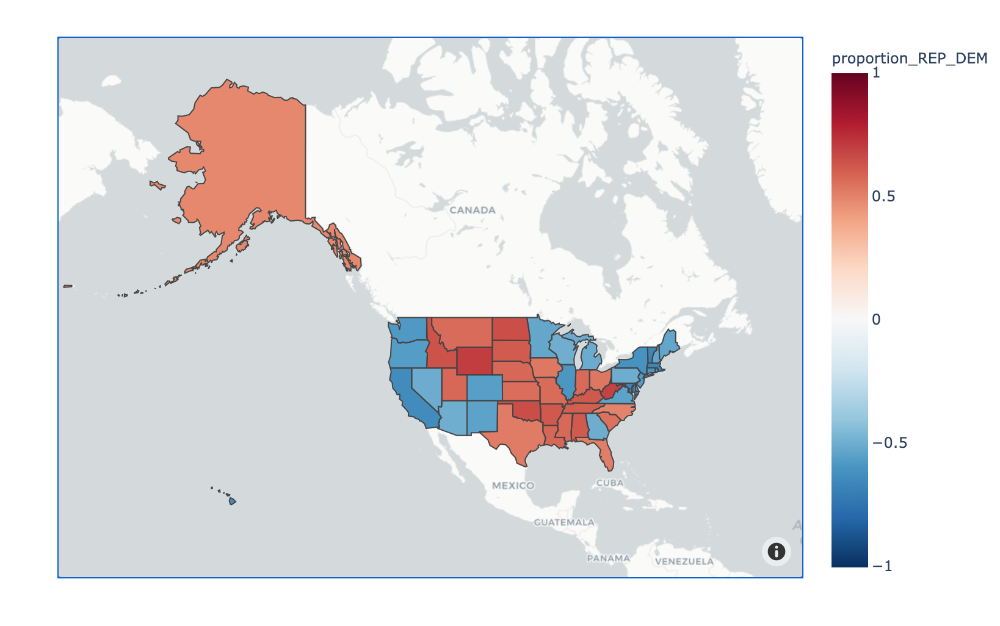
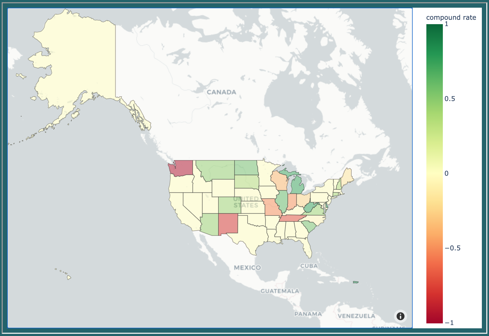
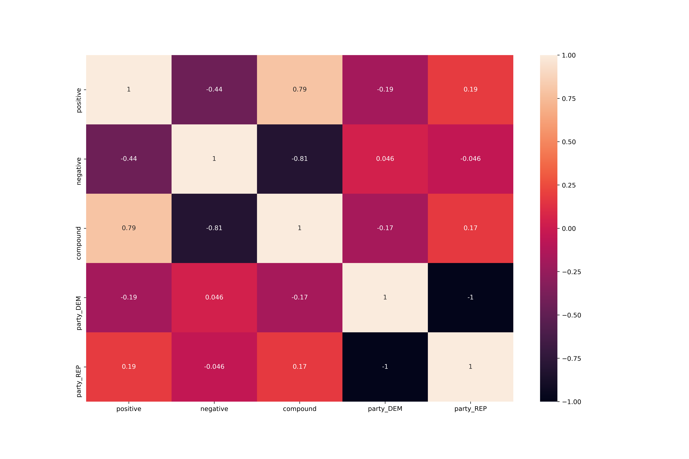
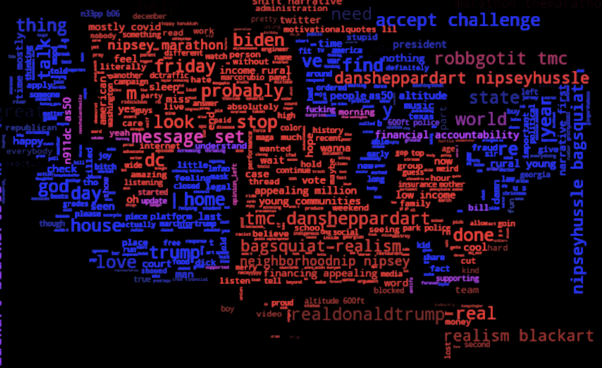
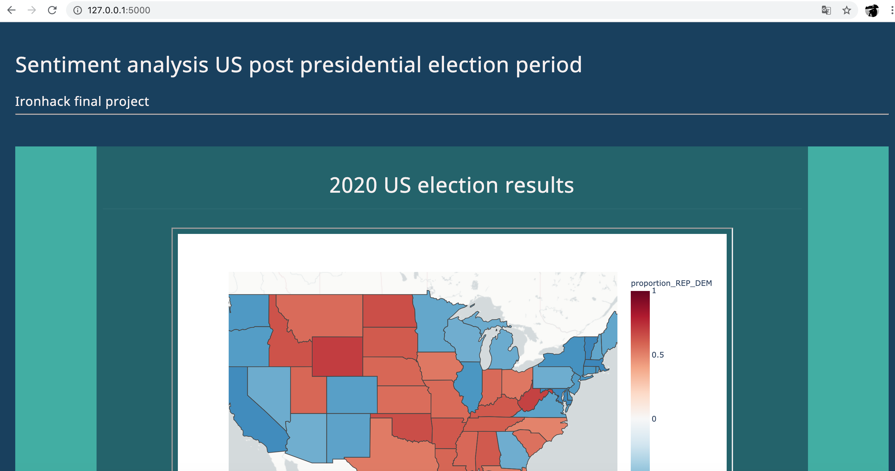
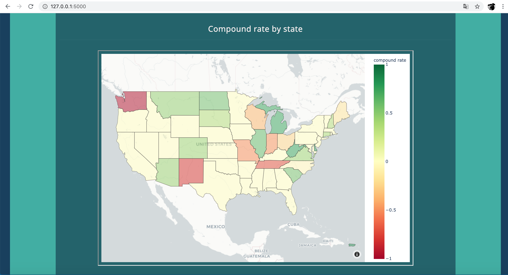
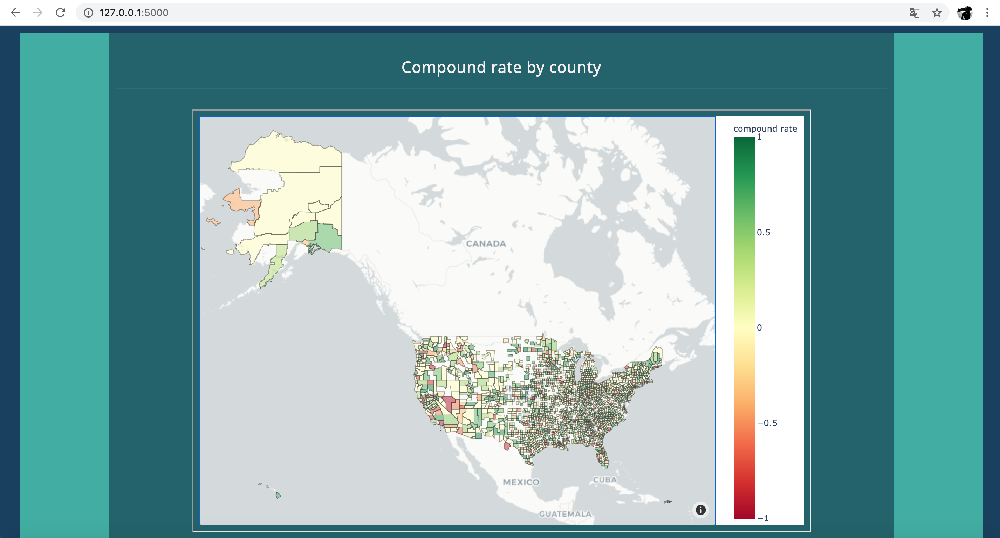

# Sentiment Analysis in a US post presidential election period

This project is an ingenuous analysis of the sentiments from 286.099 tweets throgh all US without bias (no filters) during the post presidental election period.

## The steps I followed were:

1. Twitter API
    - Get access.
    - Create a function to get more and more tweets.

2. Data cleaning and wrangling
    - Clean the data 
    - Add the coordenates and the points
    - Add the id state and id county to be readible by the plotly funtions.

3. Sentiment analysis

4. Create the maps according with the results of the analysis

5. Get the election result. I got the data from [Kaggle](https://www.kaggle.com/unanimad/us-election-2020)

6. Data cleaning and wrangling
    - Clean the data 
    - Add the coordenates and the points
    - Add the id state and id county to be readible by the plotly funtions.

7. Create the map according with the resuts

8. Create a correlation heatmap

9. Create the wordclouds and compare given the results obtained in the lasts steps.

10. Build a web page with flask in order to present my project.

## Tools and procedures:

- Data cleaning and wrangling
- API requests
- Data visualization
- Geolocation
- Webscraping
- Flask
- HTML
- CSS

- Libraries:

    - shapely
    - plotly
    - nltk
    - pandas
    - numpy
    - wordcloud
    - seaborn
    - scipy
    - tweepy

